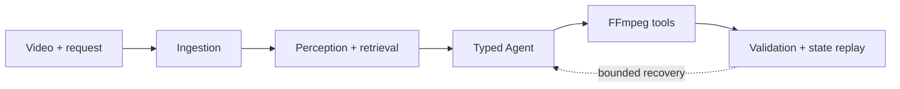

<div align="center">
  <h1>CutAgent-RL</h1>
  <p><strong>A research prototype for grounded video-editing agents.</strong></p>
  <p>Multimodal retrieval · Structured decisions · Real FFmpeg tools · Verifiable outcomes</p>
  <p>
    <a href="#system">System</a> ·
    <a href="#results">Results</a> ·
    <a href="#get-started">Get started</a> ·
    <a href="#project-map">Project map</a>
  </p>
</div>

> [!NOTE]
> This is a curated **public source snapshot**, not a complete release of the
> private research archive. Model weights, media, raw data, protected Gold,
> experiment artifacts, and prior Git history are not included.

## Overview

CutAgent-RL studies how a video agent can locate relevant moments, choose
editing actions, run real media tools, and verify the result. The repository
contains the typed runtime, ingestion and retrieval components, FFmpeg tool
environment, benchmark code, and small post-training experiments.

The central research finding is **negative**: the post-training runs did not
demonstrate better end-to-end task success. This project is a research prototype,
not a production video editor.

## System



| Layer | What is in this repository |
| --- | --- |
| Grounding | Video ingestion, multimodal perception, temporal retrieval |
| Agent | Typed state and tool calls, bounded recovery, replayable trajectories |
| Execution | Real FFmpeg editing tools and media validation |
| Research | CutAgentBench evaluation and SFT, DPO, reward-model, GRPO code |

## Results

The completed protected comparison measured task success rate (TSR):

| Split | Prompt-only | M6 SFT |
| --- | ---: | ---: |
| Locked test · 60 tasks | 0/60 | 0/60 |
| Adversarial test · 30 tasks | 4/30 | 0/30 |

The four prompt-only successes were **correct refusals of impossible requests**,
not completed video edits. Training improved some intermediate retrieval
measurements but did not improve full-Agent completion.

A separate 20-task **development** regression on one generated video compared
baseline handoff with compact recovery:

| Case type | Baseline | Compact recovery |
| --- | ---: | ---: |
| Ordinary edits · 12 | 10/12 | 11/12 |
| Injected timeout · 6 | 0/6 | 1/6 |
| Correct refusals · 2 | 2/2 | 2/2 |

These are small, overlapping cases—not evidence of generalization or production
reliability. The underlying private evaluation artifacts are not distributed
here, so these are reported historical observations, **not a public rerun**.
See the [publication report](reports/PUBLICATION_REPORT.md) for scope and checks.

## Get started

Python 3.11+, [uv](https://docs.astral.sh/uv/), and FFmpeg/FFprobe are needed
for the full local test suite. From the repository root:

```bash
uv sync --group dev
uv run pytest -q
uv run ruff check .
uv run mypy src evaluation/src training/src scripts
```

To inspect the reduced real-model Agent entry:

```bash
uv run python -m scripts.harness_run --help
```

Real inference requires optional model dependencies, authorized input media,
and a user-supplied local model cache. There is **no silent mock fallback**.
The reduced entry does not perform fresh perception for arbitrary new videos;
protected evaluation also requires non-public material and cannot be rebuilt
from this snapshot alone.

## Project map

| Path | Purpose |
| --- | --- |
| [`src/cutagent/`](src/cutagent/) | Runtime, schemas, perception, retrieval, tools |
| [`evaluation/`](evaluation/) | Benchmark construction and evaluation |
| [`training/`](training/) | Post-training contracts and methods |
| [`scripts/`](scripts/) | Reproducible command-line entry points |
| [`tests/`](tests/) | Contract, unit, integration, and leakage checks |
| [`docs/`](docs/) | Selected public research protocols |

Start with the [media timebase contract](docs/MEDIA_TIMEBASE.md),
[protected-evaluation policy](docs/PROTECTED_EVALUATION_POLICY.md), and
[reward/GRPO protocol](docs/REWARD_AND_GRPO_PROTOCOL.md).

---

**License:** [All rights reserved](LICENSE). Public visibility does not grant
permission to reuse the software or redistribute associated models or media.
